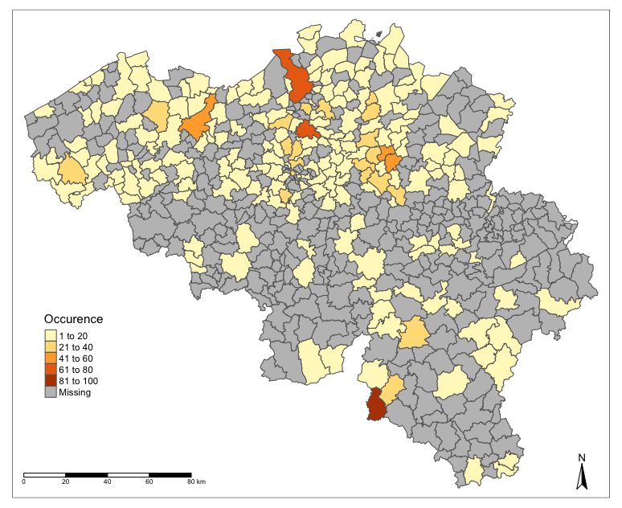

# Réalisation d'une cartes de la distribution des abeilles sauvages en Belgique

## Avant-propos

Les consignes sont reprises dans ce document, ainsi que sous forme de commentaires dans les différents fichiers. Elles sont susceptibles d'évoluer. N'hésitez pas à vérifier le lien suivant afin de voir si des modifications n'y ont pas été apportées : https://github.com/BioDataScience-Course/C06Ga_bees_belgium

## Objectifs

Cette assignation vous permettra de nous démontrer que vous avez acquis les compétences suivantes :

- traiter des données spatiales dans R

- Proposer differentes cartes dans R

## Consignes 

Complétez le carnet de notes bees_notes.Rmd afin de proposer entre 2 et 5 cartes. Détaillez votre réflexion pour obtenir vos cartes.

Vous pouvez réaliser votre carte avec {chart}, {ggplot2}, {mapview}, {leaflet} ou encore {tmap}. Il serait donc intéressant de proposer différentes cartes réalisées avec les différents packages 

Vous avez à votre disposition différentes données

- wild_bees_belgium.rds est un fichier au format rds qui comprend un sous échantillon des données Wild Bees of Belgium dont le doi [`DOI10.15468/dl.465vwp`](https://www.gbif.org/dataset/0d7c6a1a-0aab-47dc-8256-f23fefac69cd). 

- Vous avez le dossier `map_belgium` qui comprend plusieurs fichiers afin d'obtenir toute l'information nécessaire à la réalisation de la carte de la Belgique détaillée pour chaque commune. Ces données sont disponible via le lien suivant <https://www.geo.be/catalog/details/fb1e2993-2020-428c-9188-eb5f75e284b9?l=fr>. Vous avez la possibilité de travailler plutôt sur la cartes des régions ou des provinces, si vous le souhaitez.

- Vous avez le droit d'ajouter des données supplémentaires mais votre projet doit rester reproductible et comprendre l'ensemble des fichiers. Faites donc attention à la taille des fichiers.

Vous avez un script qui vous présente le pré-traitement des données et un script qui vous propose un exemple de carte.

## Astuces

Comme vous pouvez le voir dans le script R, les fichiers de bases se trouve dans un dossier `data/raw`. Les fichiers brutes étant trop volumineux et disponible sur le net sont volontairement exclus du gestionnaire de version.

La réalisation de cartes est quelques choses de chouette à réaliser. On cherche des fonds de carte au format .Geotiff, encore des shapefiles de ESRI ou encore directement au sein d'un package R et puis on fait une carte. C'est assez simple dans R et ne requiert pas de disposer de programme dédié et complexe de cartographie. Cependant, la taille des fichiers peu souvent être un problème. Nous vous conseillons d'employer `aggregate()` afin de réduire la résolution d'un raster.Il est possible d'employer `sf::st_simplify()` pour réduire la résolution d'un objet sf.
